[](https://classroom.github.com/open-in-codespaces?assignment_repo_id=20564753)

# Stream Sentry

Ferramenta web open-source (licença MIT) para automação de testes end-to-end em aplicações de videoconferência baseadas em WebRTC, com suporte a Jitsi Meet, Whereby e Zoom.

O Stream Sentry simula múltiplos usuários virtuais (Puppeteer + Chromium headless), entra em salas reais de videoconferência, coleta telemetria WebRTC em tempo real (RTT, jitter, perda de pacotes, bitrate, FPS, resolução) diretamente do `getStats()`, injeta instabilidade de rede (perfis de chaos) e gera relatórios exportáveis (JSON/CSV) com histórico persistido em MongoDB. Ele reduz a dependência de testes manuais demorados e de ferramentas proprietárias caras, integrando-se a fluxos de trabalho ágeis.

## Sumário

1. [Principais funcionalidades](#principais-funcionalidades)
2. [Equipe](#equipe)
3. [Arquitetura](#arquitetura)
4. [Fluxo de execução do sistema](#fluxo-de-execução-do-sistema)
5. [Pré-requisitos](#pré-requisitos)
6. [Dependências externas](#dependências-externas)
7. [Configuração do ambiente (passo a passo)](#configuração-do-ambiente-passo-a-passo)
8. [Variáveis de ambiente](#variáveis-de-ambiente)
9. [Execução de testes automatizados](#execução-de-testes-automatizados)
10. [Exemplos de uso](#exemplos-de-uso)
11. [Capturas de tela](#capturas-de-tela)
12. [Provedores de vídeo](#provedores-de-vídeo)
13. [Solução de problemas (troubleshooting)](#solução-de-problemas-troubleshooting)
14. [Estrutura de pastas](#estrutura-de-pastas)
15. [Licença](#licença)

## Principais funcionalidades

- Simulação de múltiplos usuários virtuais com Puppeteer e Chromium headless (mídia falsa injetada automaticamente).
- Integração intercambiável entre provedores (WebRTC, Jitsi, Whereby, Zoom) via padrão Strategy/Factory, sem alterar o núcleo do sistema.
- Telemetria WebRTC em tempo real por WebSocket: RTT, jitter, perda, bitrate, frames, resolução e pares ICE, no estilo `chrome://webrtc-internals`.
- Injeção de instabilidade de rede (chaos) aplicada via CDP durante o teste (3G lenta, alta latência, offline, instável), alterável ao vivo.
- Painel de controle ao vivo: pausar, retomar, ajustar a concorrência do pool e trocar o perfil de rede.
- Histórico e relatórios: sessões persistidas em MongoDB, reabertura da auditoria e exportação em JSON/CSV.

## Equipe

Aluno: Rafael Parreira Chequer

Professor orientador: Cleiton Silva Tavares

## Arquitetura

O Stream Sentry é organizado em quatro camadas, integradas conforme o diagrama de arquitetura lógica:

| Camada | Tecnologia | Responsabilidade |
|---|---|---|
| Frontend | React + TypeScript (Vite) | Dashboard: login, configuração de teste, auditoria em tempo real e histórico. |
| Servidor de Orquestração (Core) | Go | API REST e WebSocket (`telemetryHub`); coordena os testes e agrega as métricas. |
| Runner | Node.js + Puppeteer | Sobe os navegadores headless, simula os usuários virtuais e coleta a telemetria via `getStats()`. |
| Persistência | MongoDB | Usuários, histórico de sessões e eventos de telemetria. |

A integração com os provedores de vídeo (WebRTC, Whereby, Zoom, Jitsi) usa o padrão Strategy: cada provedor é uma estratégia intercambiável selecionada em tempo de execução por uma Factory.

Arquitetura lógica:

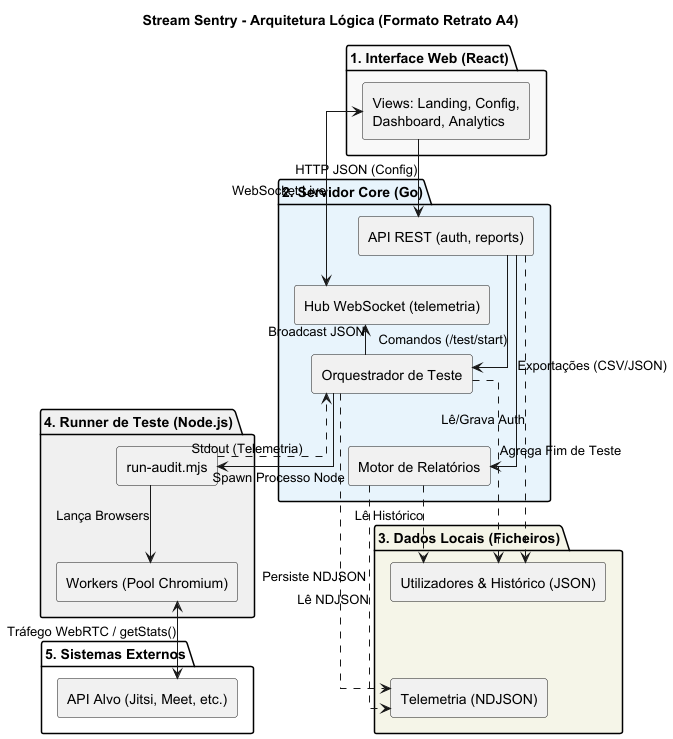

Diagrama de componentes:

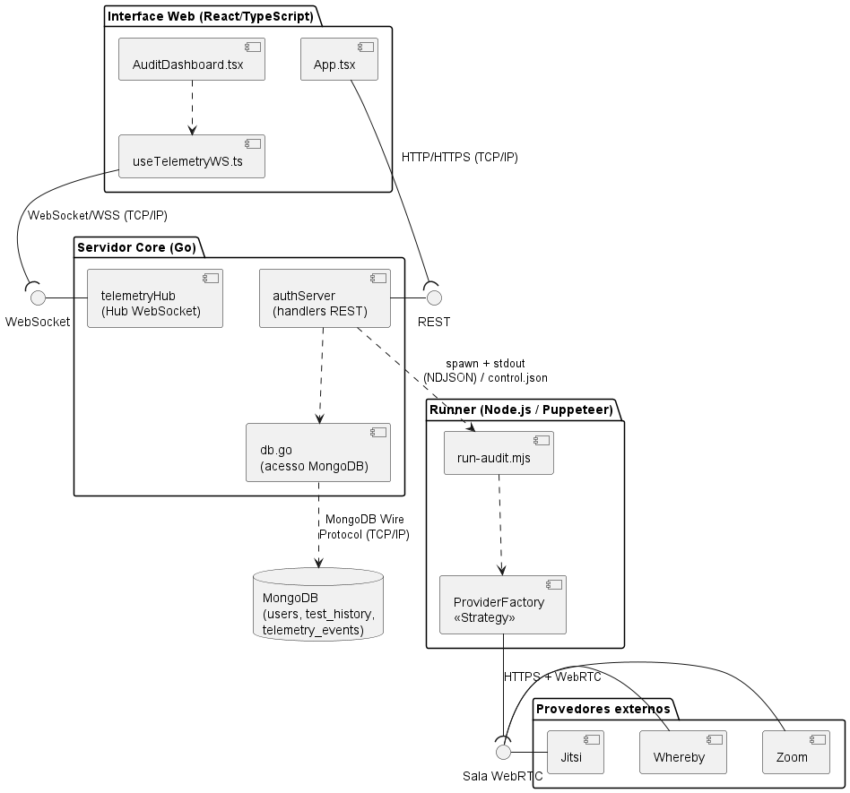

Casos de uso:

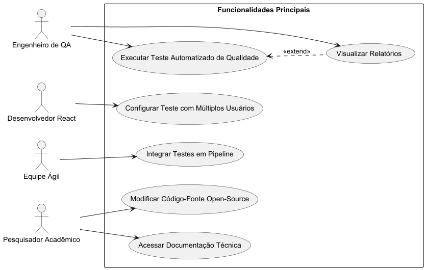

Todos os diagramas (implantação, classes, ER, sequência, atividades e comunicação) estão em [`Artefatos/`](Artefatos/), com as fontes PlantUML (`.puml`) versionadas ao lado dos `.png`.

## Fluxo de execução do sistema

```
Frontend (React)  --POST /test/start-->  Core (Go)  --spawn-->  Runner (Puppeteer, N Chromium)
      ^                                     |                          |
      |  WS /ws/telemetry (broadcast)       | persiste                 | getStats()
      +-------------------------------------+                          v
                                        MongoDB               Salas (Jitsi/Whereby/Zoom/WebRTC)
```

Passo a passo:

1. O usuário configura o alvo, a quantidade de usuários virtuais e a duração na tela Iniciar teste e dispara `POST /test/start`.
2. O Core (Go) valida a requisição e executa o pool em `puppeteer/run-audit.mjs`, mantendo N usuários virtuais na chamada.
3. Cada usuário virtual (Chromium headless) entra na sala, engancha um hook em `RTCPeerConnection` e amostra `getStats()` periodicamente.
4. As métricas voltam ao Core pela saída padrão (NDJSON). O `telemetryHub` faz broadcast por WebSocket para a aba Auditoria, enquanto os eventos são persistidos no MongoDB.
5. Quando um usuário completa a duração, o pool entra em drenagem e encerra; o status muda para Finalizado.
6. A aba Histórico permite reabrir a auditoria de qualquer sessão e exportar relatórios (JSON/CSV).

Detalhamento visual em [`Artefatos/DiagramaDeAtividades.png`](Artefatos/DiagramaDeAtividades.png) e nos diagramas de sequência (`Artefatos/DiagramaDeSequencia*.png`).

## Pré-requisitos

| Ferramenta | Versão mínima | Observação |
|---|---|---|
| Go | 1.23+ | Compila o servidor de orquestração (Core). |
| Node.js | 18+ (recomendado 20) | Runner Puppeteer e build do frontend. |
| MongoDB | 6+ | Local (`mongodb://localhost:27017`) ou Atlas. |
| Chromium | baixado automaticamente | Instalado pelo Puppeteer no `npm install`. |
| Git | qualquer | Para clonar o repositório. |

Sistemas operacionais suportados: Windows, Linux e macOS.

## Dependências externas

- MongoDB: banco de dados documental. Cria automaticamente as coleções `users`, `test_history`, `telemetry_events` e `counters`.
- Chromium (via Puppeteer): baixado no `npm install` do runner; em Linux pode exigir bibliotecas do sistema (ver seção de troubleshooting).
- Conta Whereby (opcional): necessária apenas para criar salas via API (`WHEREBY_API_KEY`).
- Conta Google (opcional): necessária apenas para atuar como anfitrião em salas Jitsi (login manual).

Bibliotecas principais:

- Backend (Go): `mongo-driver`, `gorilla/websocket`, `golang-jwt/jwt/v5`, `joho/godotenv`, `golang.org/x/crypto`.
- Runner (Node): `puppeteer`, `ghost-cursor`.
- Frontend: `react`, `react-dom`, `vite`, `typescript`, `vitest`.

## Configuração do ambiente (passo a passo)

```bash
git clone https://github.com/ICEI-PUC-Minas-PPLES-TI/plf-es-2025-2-tcci-0393100-dev-rafael-parreira.git
cd plf-es-2025-2-tcci-0393100-dev-rafael-parreira
```

### 1. MongoDB

Suba uma instância local (por exemplo, via Docker) ou use uma URI do MongoDB Atlas:

```bash
docker run -d --name mongo -p 27017:27017 mongo:7
```

### 2. Backend (`Codigo/backend/`)

```bash
cd Codigo/backend
cp .env.example .env            # ajuste os valores (ver seção Variáveis de ambiente)

cd puppeteer && npm install     # dependências do runner (baixa o Chromium)
cd ..

go mod tidy
go run .                        # API sobe em http://localhost:3001
```

### 3. Frontend (`Codigo/frontend/`)

```bash
cd Codigo/frontend
cp .env.example .env            # opcional (VITE_API_URL, padrão http://localhost:3001)

npm install
npm run dev                     # interface sobe em http://localhost:5173
```

### 4. Acessar

Abra http://localhost:5173, crie uma conta, faça login e use a tela Iniciar teste.

## Variáveis de ambiente

Configuradas em `Codigo/backend/.env` (backend e runner) e `Codigo/frontend/.env` (frontend). Todas têm padrões sensatos; nenhuma é obrigatória para um teste local básico (exceto o `MONGODB_URI`, caso o Mongo não esteja no endereço padrão).

### Core / Backend

| Variável | Padrão | Significado |
|---|---|---|
| `PORT` | `3001` | Porta da API do Core. |
| `JWT_SECRET` | `dev_secret_only` | Segredo para assinar os tokens JWT. Troque em produção. |
| `MONGODB_URI` | `mongodb://localhost:27017` | String de conexão do MongoDB (local ou Atlas). |
| `MONGODB_DB` | `stream_sentry` | Nome do banco de dados. |

### Frontend

| Variável | Padrão | Significado |
|---|---|---|
| `VITE_API_URL` | `http://localhost:3001` | URL pública da API. O WebSocket é derivado dela (`http` vira `ws`, `https` vira `wss`). |

### Runner / Puppeteer

| Variável | Padrão | Significado |
|---|---|---|
| `PUPPETEER_HEADFUL` | `0` | `1` abre o navegador visível (necessário para login manual no Jitsi). |
| `WEBRTC_STATS_INTERVAL_MS` | `2000` | Intervalo de amostragem do `getStats()`. |
| `STREAM_SENTRY_WORKER_THREADS` | `1` | Cada usuário virtual roda em uma Worker Thread. `0` usa o mesmo event loop (debug). |
| `PUPPETEER_DISABLE_QUIC` | `0` | `1` desabilita QUIC no Chromium. |
| `PUPPETEER_IGNORE_HTTPS_ERRORS` | `0` | `1` ignora erros de certificado (antivírus ou inspeção HTTPS). |
| `PUPPETEER_DISABLE_DEV_SHM` | `0` | `1` adiciona `--disable-dev-shm-usage` (útil em containers). |

### Provedores (opcionais)

| Variável | Padrão | Significado |
|---|---|---|
| `WHEREBY_API_KEY` | vazio | Chave da API do Whereby (cria salas via `POST /platform/whereby/create-room`). |
| `WHEREBY_DISPLAY_NAME` | `Stream Sentry Bot` | Nome exibido pelo usuário virtual na sala Whereby. |
| `JITSI_BASE_URL` | `https://meet.jit.si` | Servidor Jitsi usado pelo botão "Gerar sala Jitsi". |
| `JITSI_DISPLAY_NAME` | `Stream Sentry Bot` | Nome exibido na pré-sala Jitsi. |
| `JITSI_CHROME_PROFILE_DIR` | vazio | Perfil Chrome persistente para reaproveitar o login Google (funciona com 2FA). |
| `JITSI_CLAIM_HOST` | `1` | Reivindicar anfitrião após entrar. `0` entra sempre como convidado. |
| `JITSI_AUTH_EMAIL` / `JITSI_AUTH_PASSWORD` | vazio | Login automático por credenciais (sem 2FA; pode ser bloqueado pelo Google). |
| `ZOOM_DISPLAY_NAME` / `ZOOM_PASSCODE` | vazio | Nome e senha para links do Zoom (uso manual ou exploratório). |

A lista completa de variáveis avançadas do Jitsi e do Zoom, com comentários, está em [`Codigo/backend/.env.example`](Codigo/backend/.env.example).

### Exemplo de `.env` (backend) para uso local

```env
PORT=3001
JWT_SECRET=troque_por_um_valor_aleatorio_longo
MONGODB_URI=mongodb://localhost:27017
MONGODB_DB=stream_sentry
# Opcional, habilita "Criar sala Whereby":
# WHEREBY_API_KEY=sua_chave_whereby
```

### Exemplo de `.env` (frontend)

```env
VITE_API_URL=http://localhost:3001
```

## Execução de testes automatizados

Backend (Go), testes unitários de validação e de agregação de telemetria:

```bash
cd Codigo/backend
go test ./...
```

Frontend (Vitest), testes de validação de configuração:

```bash
cd Codigo/frontend
npm test
```

Smoke test do Puppeteer, acesso simples a um alvo salvando evidências em `backend/puppeteer/artifacts/<timestamp>/` (`access-log.json`, `final-page.png`):

```bash
cd Codigo/backend/puppeteer
npm run smoke
```

O smoke test também é acessível pela interface, no botão Testar Puppeteer.

## Exemplos de uso

### Pela interface (recomendado)

1. Crie uma conta e faça login.
2. Em Iniciar teste, clique em Criar sala Whereby ou Gerar sala Jitsi; a URL é preenchida automaticamente.
3. Defina os usuários virtuais e a duração da chamada, depois clique em Iniciar.
4. Acompanhe as métricas ao vivo na aba Auditoria e aplique perfis de chaos.
5. Veja e exporte os relatórios na aba Histórico.

### Pela API (exemplo com `curl`)

```bash
# 1. Cadastro, retorna { "token": "..." }
curl -X POST http://localhost:3001/auth/register \
  -H "Content-Type: application/json" \
  -d '{"name":"Rafael","email":"rafael@exemplo.com","password":"senha12345"}'

# 2. Iniciar um teste (use o token do passo anterior)
curl -X POST http://localhost:3001/test/start \
  -H "Authorization: Bearer <TOKEN>" \
  -H "Content-Type: application/json" \
  -d '{
        "apiUrl": "https://meet.jit.si/MinhaSalaUnica",
        "accessToken": "",
        "virtualUsers": 3,
        "callDurationSec": 120,
        "headful": false,
        "chaos": { "profile": "off" }
      }'

# 3. Acompanhar a telemetria ao vivo (WebSocket)
#    GET ws://localhost:3001/ws/telemetry?token=<TOKEN>
```

Principais rotas da API: `POST /auth/register`, `POST /auth/login`, `GET /auth/me`, `POST /test/start`, `GET /test/status`, `POST /test/stop`, `GET /tests/history`, `GET /reports/session/{id}`, `GET /reports/export`, `GET /ws/telemetry`, `POST /platform/whereby/create-room`, `POST /platform/jitsi/room-url`, `GET /health`.

## Capturas de tela

| Landing page | Login |
|---|---|
| 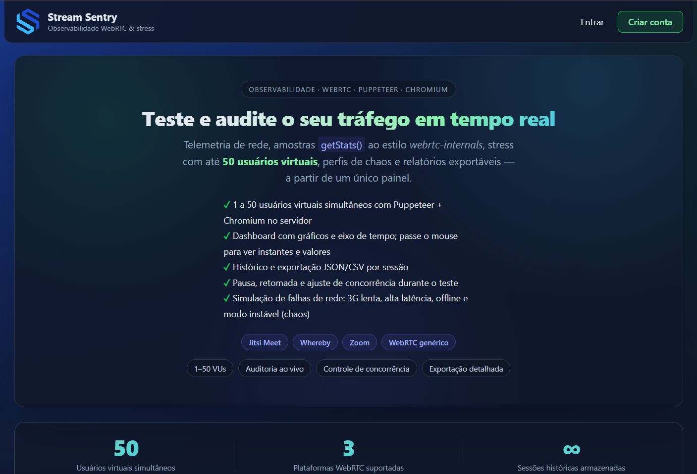 | 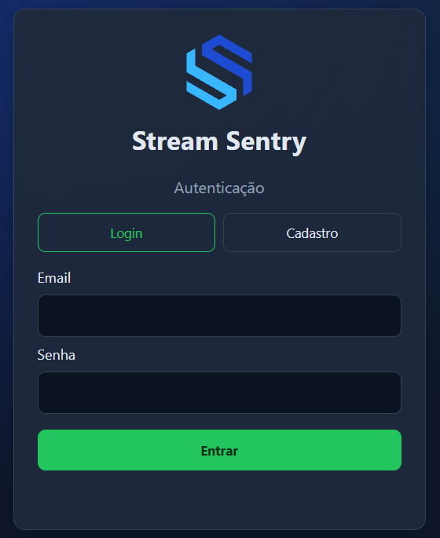 |

| Iniciar teste | Iniciar teste (configuração) |
|---|---|
| 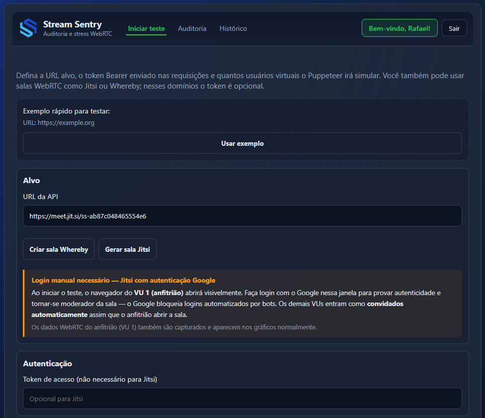 | 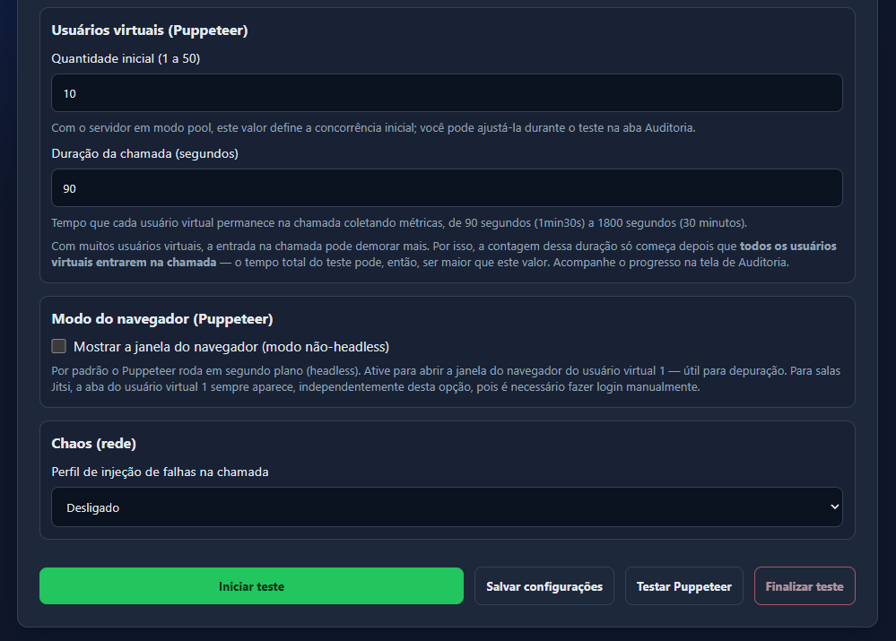 |

| Auditoria em tempo real | Auditoria (métricas WebRTC) |
|---|---|
| 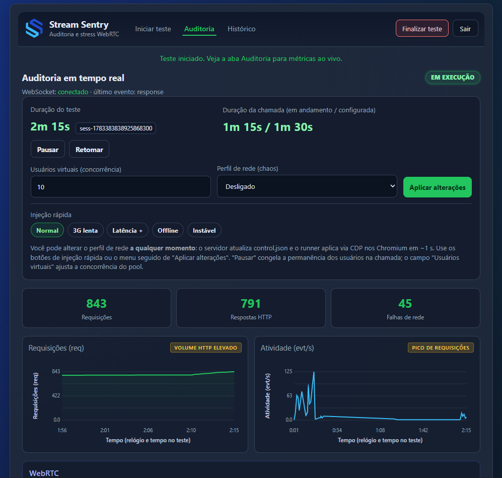 | 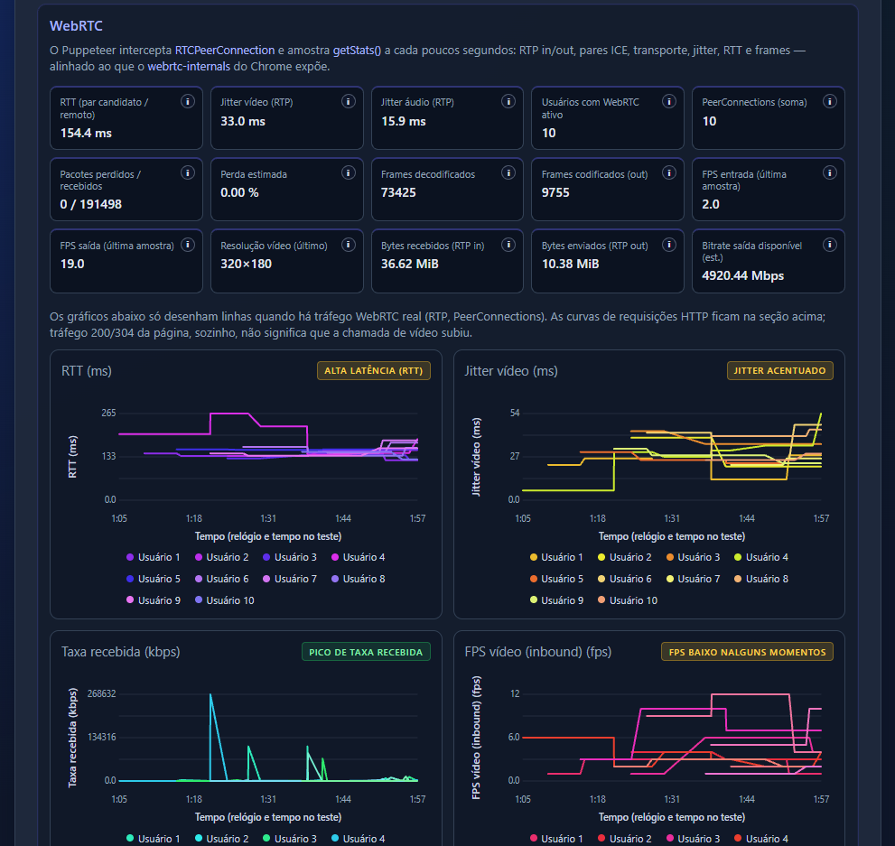 |

| Auditoria (gráficos) | Histórico de testes |
|---|---|
| 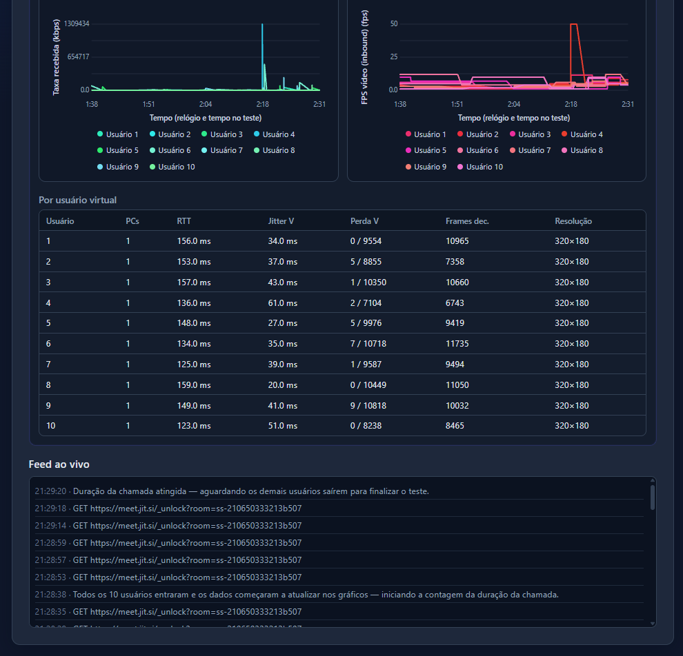 | 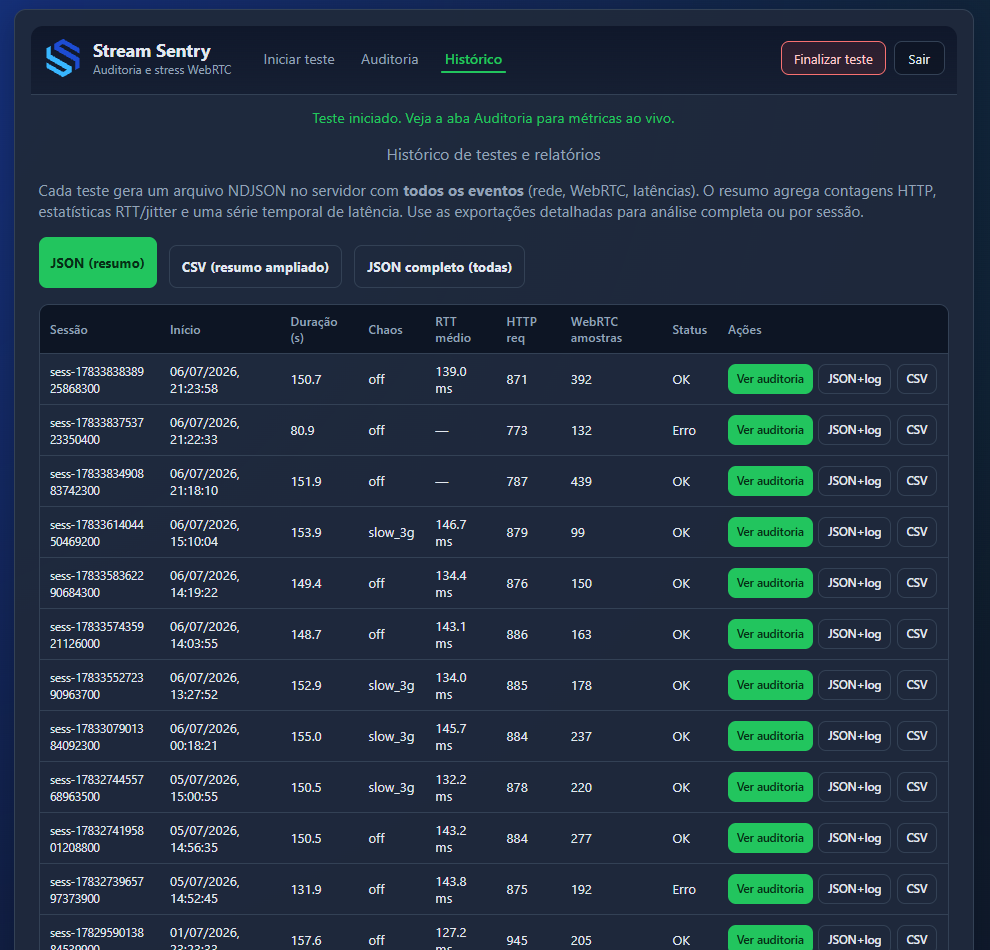 |

## Provedores de vídeo

| Provedor | Automação | Métricas | Capacidade | Observação |
|---|---|---|---|---|
| Jitsi | Quase total (anfitrião faz login manual) | Completas | até 50 usuários | Melhor opção para escala. |
| Whereby | Total (via API, entra sozinho) | Completas | 4 usuários (plano grátis) | Ideal para demonstração autônoma. |
| Zoom | Inviável (anti-bot) | Parciais | até 10 | Disponível apenas para uso manual ou exploratório. |

O passo a passo detalhado de cada provedor (incluindo o login manual do Jitsi, perfis persistentes e limitações do Zoom) está em [`Codigo/README.md`](Codigo/README.md).

## Solução de problemas (troubleshooting)

| Sintoma | Causa provável e correção |
|---|---|
| Backend não sobe ou erro de conexão ao iniciar | MongoDB não está rodando ou `MONGODB_URI` incorreta. Verifique `docker ps` e o serviço do Mongo. |
| `go run .` falha por versão | É necessário Go 1.23+. Verifique com `go version`. |
| `npm install` do runner falha ao baixar o Chromium | Rede ou proxy. Reexecute; em Linux, instale as libs do Chromium (`libnss3`, `libgbm1`, `libasound2`, entre outras). |
| Login ou cadastro não funciona | Backend fora do ar ou `VITE_API_URL` apontando para o endereço errado. |
| Aba Auditoria não recebe dados (WebSocket) | `VITE_API_URL` diferente do endereço real do backend, ou token inválido. |
| Métricas WebRTC ficam zeradas | Use 2 ou mais usuários (um bot sozinho não tem par); confira se o bot entrou na sala. |
| Chromium mostra "Não seguro" ou erro de certificado no `meet.jit.si` | Antivírus ou inspeção HTTPS. Suba o backend com `PUPPETEER_IGNORE_HTTPS_ERRORS=1` e confira a data e hora do sistema. |
| Jitsi: bots ficam aguardando o moderador | O `meet.jit.si` exige anfitrião autenticado. Faça o login Google manual no usuário virtual 1 (`PUPPETEER_HEADFUL=1`) ou use um perfil persistente. |
| Whereby: "Criar sala" falha | `WHEREBY_API_KEY` ausente ou inválida. |
| Teste trava ou Chromium é encerrado com muitos usuários | Pouca memória RAM. Reduza os usuários virtuais e mantenha o modo headless. |
| Zoom bloqueia o bot | Comportamento esperado (anti-bot). Use Whereby ou Jitsi. |

## Estrutura de pastas

```
.
├── Codigo/
│   ├── backend/            # Core em Go (API REST, WebSocket e orquestração)
│   │   ├── main.go, db.go, ...
│   │   ├── *_test.go       # testes unitários (Go)
│   │   ├── .env.example
│   │   └── puppeteer/      # Runner Node.js (run-audit.mjs, smoke.mjs)
│   ├── frontend/           # Interface React + Vite (TypeScript)
│   │   ├── src/            # inclui validation.test.ts (Vitest)
│   │   └── .env.example
│   └── README.md           # guia detalhado de execução e provedores
├── Artefatos/              # Diagramas (.puml e .png), personas e capturas de tela
├── Documentacao/           # Documento de Visão e de Projeto
├── LICENSE                 # MIT
└── README.md               # este arquivo
```

## Licença

Distribuído sob a licença MIT. Veja [`LICENSE`](LICENSE) e [`CITATION.cff`](CITATION.cff).
